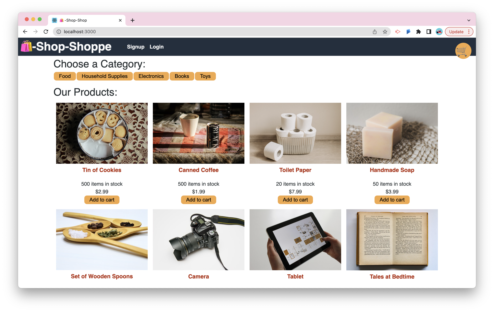

# Shop-Shoppe  🛍


## Description

An MERN stack e-commerce platform that centralized its state data globally using React's Context API. The application features a persistent shopping cart, and has offline capabilities using indexedDB. The Stripe API is integrated for secure payment processing.

## Technologies Used:

- ReactJS
- NodeJS
- MongoDB
- Mongoose ORM
- Express
- GraphQL
- JSON Web Tokens
- bcrypt package
- Apollo Server
- Apollo Client
- Vercel
- Stripe API
- IndexedDB
  <br>

## Table of Contents

- [Installation](#installation)
- [Usage](#usage)
- [Deployed Link](#deployed-link)
- [License](#license)
- [Questions](#questions)

  <br>

## Installation

Use the following command to download dependencies for the project:

```
npm install
```

  <br>

## Usage


</br>
The application allows users to sign up and create an account to make purchases. The application features a persistent shopping cart on all pages. To complete a transaction,users will be required to sign up and login. The application has offline capabilities that allow users to add and remove items in their shopping cart while offline. Users can complete their shopping cart transaction securely with the use of Stripe.

<br>

## Deployed Link

[Shop-Shoppe App](https://shop-shoppe.vercel.app/)
</br>

## License

This project is licensed under the [MIT License](https://choosealicense.com/licenses/mit/).  
 </br>

## Questions

[GitHub](https://github.com/dneflas)
